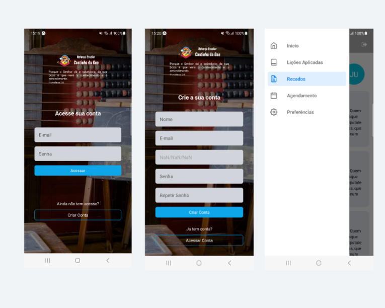

## Tutoring Session Project

This project aims to develop an app for **Cantinho da Geo's** tutoring session.

### The main features include:

- Listing the lessons taught.
- Listing notes and observations that the teacher needs to communicate to parents.
- Communication via WhatsApp.
- Allowing students/parents to choose class times and the number of classes per week.
- Attendance percentage tracking.
- Login and account creation.

### This is a Architecture from the project

